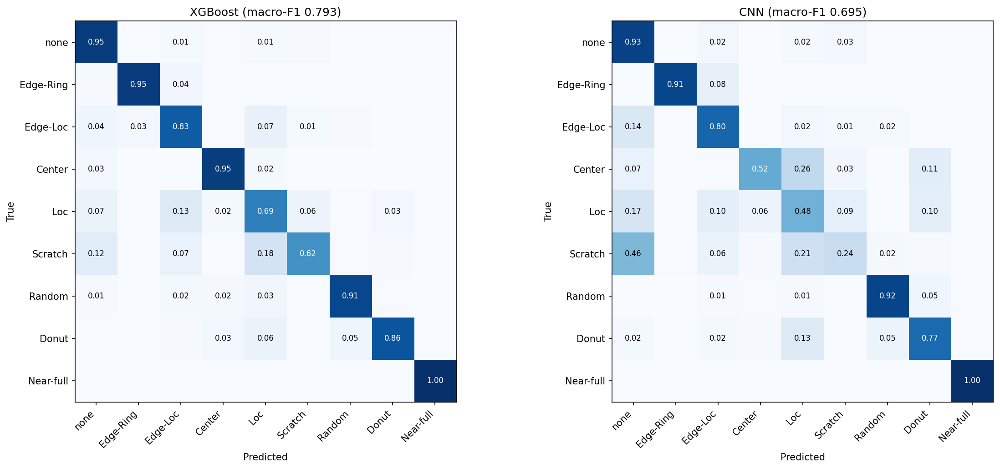
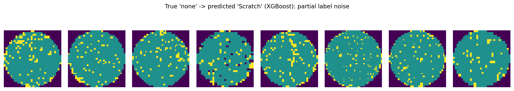
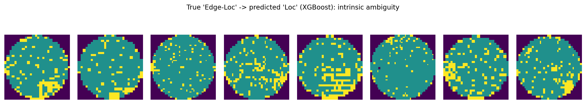
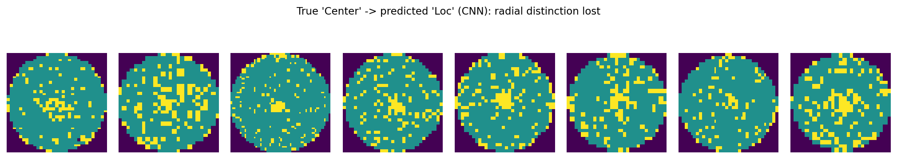
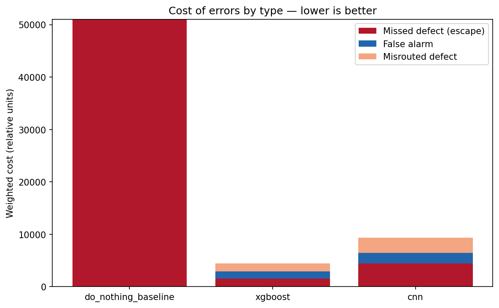
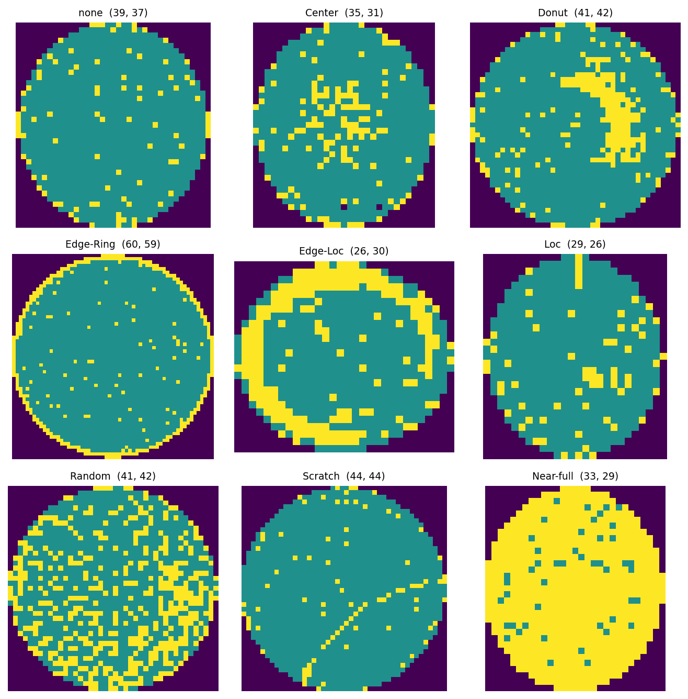

# Wafer Map Defect Pattern Classification (WM-811K)

**Spatial defect-pattern classification on 172,950 production wafer maps, with each pattern interpreted back to a likely process root cause.**

> **Project status: complete — all 5 stages done.**
> The full pipeline is built and reproducible: data engineering and integrity
> audit, physically-motivated feature engineering, class-imbalance handling,
> four-model comparison across both routes, and a per-class evaluation that reads
> every confusion by process mechanism and translates model performance into
> yield-economic terms. See the [Roadmap](#roadmap) for the stage-by-stage map.

---

## Why this project

In high-volume semiconductor manufacturing, a wafer map is a spatial pass/fail
record of every die on a wafer. The *shape* of the failing region is
diagnostic: a ring of failures at the edge implicates a different process step
than a tight cluster at the center or a thin diagonal line. Today much of this
pattern review is done by eye, which is slow, subjective, and does not scale to
the volume a modern fab produces.

This project automates that first triage step — classifying each wafer map into
one of nine spatial defect patterns — and, crucially, **maps each pattern to
the process mechanism most likely to have produced it.** That second half is
the point. A classifier that says "this is an Edge-Ring" is a data-science
result; a classifier whose output tells a yield engineer *to go audit
edge-bead removal and bevel processes rather than deposition chemistry* is a
metrology tool. I approach the problem from that process-engineering angle
throughout.

**Target patterns (9 classes):** `Center`, `Donut`, `Edge-Ring`, `Edge-Loc`,
`Loc`, `Scratch`, `Random`, `Near-full`, `none`.

---

## Dataset — WM-811K (LSWMD)

Real wafer maps collected from fabrication, released by the MIR Lab. Each map
encodes `0` = outside the wafer, `1` = die passed test, `2` = die failed test.

| Property | Value |
|---|---|
| Total wafer maps | 811,457 |
| Hand-labeled maps used | 172,950 |
| Classes | 9 |
| Largest class (`none`) | 147,431 |
| Smallest class (`Near-full`) | 149 |
| Class imbalance ratio | ~989 : 1 |
| Distinct wafer-map shapes | 346 |

### Data-integrity findings

Before any modeling, the raw file needed careful auditing. Several traps here
would silently corrupt a naive pipeline:

- **The `failureType` column is not what it appears to be.** Labels are stored
  as *nested numpy arrays*, and unlabeled wafers hold an **empty array rather
  than `NaN`**. A standard `df.dropna()` therefore removes nothing and quietly
  returns all 811k rows — you would train on ~638k label-less wafers with no
  error and no warning. Handled with a custom unwrapping function that converts
  empty arrays to true nulls before filtering.
- **The official train/test split is inverted** (Test = 118,595 vs Training =
  54,355). It is departed from deliberately: a fresh **stratified 80/20 split
  is performed in Stage 3** (138,360 train / 34,590 test), with every class
  held to its full-set proportion so the rarest classes survive intact in both
  partitions. The reasoning is documented rather than hidden.
- **Label noise in the `none` class.** Direct inspection found maps labeled
  `none` that carry visible edge-failure structure. `none` means "no
  systematic pattern was annotated," which is not the same as "clean" — and it
  is *not* the same as "unlabeled" (never reviewed). This distinction is
  tracked throughout.
- **346 distinct map shapes.** Wafer maps vary in pixel dimensions by product
  and die size. A defect pattern is defined by its *geometry on the wafer*, not
  its pixel count — which is the technical justification for the
  size-invariant features below.

---

## Approach — two parallel routes

The project builds two independent representations of every wafer and will
compare them head-to-head:

1. **CNN route.** Every map is resized to a fixed 64×64 grid so the maps can be
   stacked into a single tensor a convolutional network can consume. High
   ceiling on accuracy, but a black box — it cannot tell a process engineer
   *why* it flagged a wafer.

2. **Classical route.** A compact set of hand-crafted, physically-motivated
   features feeds a classical model (Random Forest / XGBoost / SVM). Lower
   ceiling, but every feature traces to a named process mechanism, and the
   model's feature-importance output is directly interpretable.

For a defect-metrology or lithography role, the interpretable route is arguably
the more important of the two — it is what demonstrates understanding of the
physics rather than just the library calls. Building both, and comparing them,
is a deliberate choice.

---

## Feature engineering (classical route)

Each hand feature is designed from a physical hypothesis about how a specific
pattern arises, and each is **size-invariant** so wafers of any pixel dimension
are directly comparable.

| Feature group | What it measures | Patterns it separates | Process interpretation |
|---|---|---|---|
| **Radial density profile** (10 concentric rings) | Failure rate as a function of normalized radius, center → edge | Center · Donut · Edge-Ring · none | Radial process non-uniformity — the same center-to-edge framing used to analyze CMP removal rate, spin-coat thickness, or hot-plate temperature gradients |
| **Radon linearity** (peak, peak-to-mean ratio) | Presence and strength of *collinear* failures | Scratch | Mechanical handling damage (robot end-effector, tweezer/wand contact, a dragged particle) — a signature distinct from process-chemistry defects |
| **Connectivity** (largest-blob fraction, fragmentation) | One contiguous failing region vs. scattered speckle | Near-full vs Random | Global process excursion (wrong recipe, gross exposure/bake failure) vs. distributed particle contamination |
| **Angular concentration** (histogram peakedness) | How concentrated failures are around the wafer's angular range | Edge-Ring (full wrap) vs Edge-Loc (localized arc) | Rotationally-symmetric process signature (edge-bead removal, bevel etch) vs. a single point of chuck/clamp contact |

**Why density alone is not enough — the Scratch case.** A scratch may be ~15
failed dies out of ~1,500. Its failure *rate* is indistinguishable from
background noise; the entire signal lives in the *arrangement* of those dies,
not their count. The Radon transform integrates the failure map along straight
lines at many angles, so a set of collinear failures stacks into a sharp peak
that a density metric is blind to. This is the clearest example of encoding
domain physics directly into a feature.

### Honest engineering notes

These are kept in the notebooks rather than scrubbed out, because the process
of diagnosing and fixing a feature is itself evidence of engineering judgment:

- **The first angular feature failed.** A gap-based "angular coverage" measure
  could not separate Edge-Ring from Edge-Loc — a few stray failures filled the
  "empty" arc and made a localized Edge-Loc read as fully wrapped. It was
  re-designed as a histogram-based *concentration* measure, which is robust to
  strays because they dilute across bins. Both versions are retained.
- **One redundant feature was confirmed and removed.** A Radon summary
  (`radon_angle_strength`) was computed as `sino.max(axis=0).max()`, which is
  arithmetically identical to the global `sino.max()` already stored as
  `radon_peak` — a guaranteed exact duplicate on every wafer. Before dropping
  it, an assertion verified the two columns are bit-for-bit equal across all
  172,950 rows; only then was it removed. Dropping it also protects Stage 4's
  feature-importance readout, where two identical columns would split
  `radon_peak`'s importance in half and understate it.
- **A "dead feature" assumption was tested in code — and proved wrong.** The
  two outermost radial rings were expected to be structurally empty: the radial
  profile bins distance out to the corner of the square frame, so for a perfect
  disc inscribed in that square the outer rings should fall in empty corners
  (no dies, rate 0). Plausible enough that both this project's Stage 2 notes and
  my first Stage 3 draft treated them as dead and dropped them. **A verification
  check falsified the assumption**: rings 9 and 10 are non-zero for 4,164 and
  888 wafers respectively. The cause is physical — the profile normalizes
  distance to the *farthest die in each map*, not to a fixed disc, and with 346
  distinct map shapes, many non-square / off-center / partial maps place real
  dies out at the bounding-box corner (normalized radius > 0.8). A ring 9/10
  signal therefore encodes *"this map's dies reach its corner"* — a real, if
  minority, structural cue. **Decision: both rings retained**, and Stage 4
  feature-importance — not a guess — decides whether they discriminate. Every
  drop is verified in code precisely because a reasonable-sounding assumption
  turned out to be wrong across ~5,000 wafers.
- **Edge-Ring vs Edge-Loc is expected to be the hard pair.** Both are
  edge-dominated and differ only in angular spread. This is predicted *now*,
  from feature behavior, and will be checked against the Stage 5 confusion
  matrix.

---

## Class-imbalance handling (Stage 3)

With a ~989:1 ratio, imbalance is not a footnote — it shapes the split, the
metric, and the training signal. Three decisions, each matched to the data type
it is physically valid for:

- **Stratified split, computed on train only.** The dataset's inverted official
  split is replaced with a fresh stratified 80/20 split (138,360 / 34,590).
  Stratification holds every class to its full-set proportion, verified to two
  decimal places in both partitions — so `Near-full` (149 total) is guaranteed
  ~30 wafers in the test set rather than risking 0 under a naive random split,
  which would leave its per-class F1 undefined. All imbalance handling is fit on
  the training partition only; **the test set keeps the real ~989:1
  distribution**, because that is the wafer mix the fab actually runs, and a
  rare-class recall number only means something when measured against
  realistically rare data.

- **Class weights, not resampling, for the classical route.** Each class is
  weighted by scikit-learn's `balanced` rule (`n / (n_classes · n_class)`),
  derived from the training labels alone. The resulting multipliers span from
  `none` at 0.13 up to `Near-full` at ~129 — a spread of ~991×, recovering the
  raw imbalance ratio almost exactly. Weights up-weight rare-class errors
  without fabricating any data. The multipliers are computed and inspected
  explicitly rather than left as an opaque `class_weight='balanced'` flag, so
  the imbalance correction is an auditable number.

- **Resampling rejected, with reasons.** SMOTE-style interpolation was
  considered and declined. On the image route it is invalid for the same reason
  bilinear resizing was rejected in Stage 2 — interpolating between two wafer
  maps invents fractional die states that correspond to no physical die
  condition. Geometric augmentation (90° rotations and mirror flips, which map
  die-to-die exactly with no interpolation) is the physically valid rare-class
  multiplier for the CNN, and is built into Stage 4 where the CNN lives. So:
  **weights for the feature model, geometric augmentation for the image model,
  interpolation-based resampling rejected on both.**

**Metric consequence to watch (Stage 5).** Up-weighting `Near-full` ~129×
pushes the model to *never miss* one, raising its recall — but the same
pressure makes it fire on ambiguous maps, lowering its precision. Class
weighting trades rare-class recall for rare-class precision; it does not
dissolve the imbalance. Macro-F1, as the harmonic mean of the two, is built to
expose exactly that trade — which is why it, not accuracy or recall alone, is
the steering metric.

---

## Modeling — four-model comparison (Stage 4)

Both routes were trained and evaluated on the **identical frozen test set** (the
34,590-wafer stratified partition from Stage 3), so every score below is
directly comparable — the shared split indices guarantee all four models were
judged on the same wafers. Steering metric throughout is **macro-F1**, never
accuracy.

| Model | Macro-F1 | Accuracy | Role in the comparison |
|---|---|---|---|
| **XGBoost** (classical) | **0.7934** | 0.9415 | Best overall; extracts the collinearity signal the RF underused |
| Random Forest (classical) | 0.7893 | 0.9632 | Interpretable anchor; feature-importance baseline |
| Linear SVM (classical) | 0.7459 | 0.9506 | Linear-separability probe (see below) |
| CNN (image route) | 0.6949 | 0.9158 | Raw 64×64 pixels + geometric augmentation |

The accuracy column is deliberately shown *beside* macro-F1 to expose the
imbalance trap: the Random Forest posts the **highest accuracy (0.963) yet not
the best macro-F1**, precisely because accuracy is inflated by the 85% `none`
majority while macro-F1 weights all nine classes equally.

### Headline result — physics-informed features beat the CNN

On 172,950 wafers, the hand-engineered classical route **outperformed the CNN by
~10 macro-F1 points**, and the per-class pattern of wins and losses is
explainable by the *geometry of each defect* versus the *inductive bias of each
representation*:

- **Global-geometry defects favour hand features, decisively.** A *Scratch* is
  ~15 collinear dies among ~1,500 — a thin global line with almost no local
  texture. Convolutions see local neighbourhoods, so the CNN collapsed on
  Scratch (F1 0.148), while the Radon feature — which integrates along the
  entire line at once — let XGBoost reach F1 0.403 (recall 0.62). *Donut* tells
  the same story: an annular center-pass / mid-fail / edge-pass relationship the
  radial-ring profile encodes directly, but the CNN must discover from pixels
  (CNN F1 0.512 vs XGBoost ~0.83). Both cases are the domain-feature advantage
  made quantitative.
- **The one class where the CNN wins is the feature-limited one.** *Edge-Loc*
  capped all three classical models at ~0.66–0.73 F1, because the single
  angular-concentration scalar cannot cleanly separate a localized arc from a
  full ring (the confusion predicted from Stage 2). The CNN, seeing the raw arc
  geometry, lifted Edge-Loc recall to 0.82 — the clean illustration that raw
  pixels help exactly where a hand feature is too coarse.
- **Model-limited vs feature-limited, separated.** Scratch improved sharply from
  Random Forest (recall 0.20) to XGBoost (0.62) — the *feature* was adequate,
  the RF just under-used it (Radon importance ranked 8th by RF impurity but 1st
  by XGBoost gain). Edge-Loc, by contrast, barely moved across all three
  classical models — the *feature* is the ceiling. Distinguishing these two
  failure modes is a diagnostic result, not a leaderboard number.

### The linear-separability probe

The linear SVM lands at 0.7459 — within ~4.7 macro-F1 points of XGBoost despite
drawing only flat hyperplanes. That small gap is a direct endorsement of the
feature engineering: **the physics-motivated features make the nine classes
nearly linearly separable**, so the tree models' non-linear machinery buys only
a few points. A weak feature set would have left the linear model far behind.

### Honest caveat

The CNN is deliberately compact (~110k parameters, single training run, no
architecture search). The defensible claim is *not* "CNNs cannot do this" — it
is that **with comparable effort and interpretability held equal, physics-informed
features won, and the per-class pattern shows why that outcome is principled
rather than accidental.** A larger CNN or a two-channel (die-present / die-failed)
encoding might narrow the gap; that is noted as future work rather than hidden.

The confusion matrices behind these numbers are read *by physical mechanism* in
Stage 5, where each off-diagonal cell is explained as a process signature rather
than a dark square.

---

## Process root-cause interpretation

This is the half of the project that a defect-metrology or yield role is really
about: not "what pattern is this" but "which process should an engineer go
audit." Each spatial signature maps to a family of candidate mechanisms. These
are framed as **hypotheses** — the shortlist a yield engineer carries into a
root-cause investigation — not single-cause certainties; the value is pointing
the investigation at the right process area.

| Pattern | Spatial signature | Candidate process root cause(s) |
|---|---|---|
| **Center** | Failures concentrated toward the wafer center, decaying outward | Radial process non-uniformity peaking at center — consistent with CMP removal-rate non-uniformity, spin-coat / develop thickness variation, or a chamber center hot/cold spot in deposition or etch |
| **Donut** | Annular band of failures at mid-radius; center and edge pass | A radial *ring* signature — consistent with a focus/exposure ring in lithography, a temperature ring on a bake plate, or a mid-radius deposition/etch-rate band |
| **Edge-Ring** | Continuous ring of failures at the extreme edge | Rotationally symmetric edge process — consistent with edge-bead removal (EBR), bevel / edge etch, edge-exclusion or clamping effects, or edge-concentrated plasma non-uniformity |
| **Edge-Loc** | Localized *arc* of failures at the edge (partial, not a full ring) | A single edge contact or excursion point — consistent with a chuck/clamp contact mark, an edge-handling touchpoint, or a localized edge-process excursion |
| **Loc** | A compact cluster of failures away from the edge | Localized contamination or excursion — consistent with a particle/defect landing, a single stepper-field or reticle defect, or a localized hotspot |
| **Scratch** | A thin, *collinear* streak of failures | Mechanical handling damage — consistent with robot end-effector drag, tweezer/wand contact, or a particle dragged across the wafer surface |
| **Random** | Scattered failures with no spatial structure | Distributed random defectivity — consistent with baseline particle contamination or ambient yield loss rather than a systematic process signature |
| **Near-full** | Almost the entire wafer fails | A global excursion — consistent with a wrong or failed recipe, a gross exposure/develop/bake failure, a skipped process step, or a wafer-level electrical failure |
| **none** | No systematic annotated pattern | Baseline / no diagnostic pattern — but see the confusion analysis below: a fraction of `none` maps carry real structure the annotator did not label |

The feature engineering was designed around exactly these mechanisms: the radial
profile exists to separate the radial family (Center / Donut / Edge-Ring), the
Radon linearity feature exists to catch the mechanical-handling signature
(Scratch), and the connectivity features separate a global excursion (Near-full)
from distributed defectivity (Random). The model's job is triage; this table is
what turns a triage label into a process action.

---

## Confusion analysis — reading the errors by mechanism

On the frozen 34,590-wafer test set, the errors sort into **three physically
distinct kinds**, and the distinction matters more than the raw error rate: one
kind is a data-labeling artifact, one is intrinsic geometry no model escapes, and
one is a limitation of a specific representation.


*Row-normalized confusion matrices (diagonal = per-class recall). XGBoost's
off-diagonal mass sits on physically adjacent classes; the CNN's spreads into the
radial classes it cannot separate from pixels alone.*

**1. Label noise at the `none` boundary.** The single largest group of "errors"
in both models is `none → defect` — e.g. XGBoost flags 441 `none` wafers as
Edge-Loc and 292 as Scratch; the CNN flags 789 `none` wafers as Scratch. Two
models with completely different representations (engineered features vs. raw
pixels) independently agreeing that specific `none` wafers look like defects is
evidence that the `none` class is *contaminated* — that some of these are real
defects the annotator left unlabeled, not model mistakes. Direct inspection
confirms it is partial: some show clear structure, some are genuine
over-calls.


*Wafers labeled `none` but predicted Scratch. Several show an unmistakable
diagonal streak of failing dies — a scratch the annotation missed — while others
are genuine model over-calls. The `none` boundary is part label-noise, part model
eagerness.*

**2. Intrinsic geometric ambiguity (shared by both models).** Some confusions
appear in *both* models' top lists — Edge-Loc ↔ Loc, Edge-Ring → Edge-Loc,
Scratch → Loc. These are the physically hard cases: an Edge-Loc and a Loc differ
only in whether the cluster *touches* the edge, and on many real wafers that is
genuinely borderline. When two different representations both fail the same way,
the ambiguity is in the wafer, not the model.


*True Edge-Loc predicted as Loc. Several are difficult to categorize by eye —
the cluster sits near but not clearly on the edge. This confusion reflects real
geometric ambiguity, not a fixable model weakness.*

**3. Representational limits (unique to the CNN).** Every confusion the CNN makes
that XGBoost does *not* is a radial-class confusion — Center → Loc, Center →
Donut, Loc → Center. A quarter of all Center defects (26%) are misrouted by the
CNN. The reason is structural: a convolutional network reads local neighborhoods,
so it sees "a cluster" but loses "the cluster is radially *centered*" or "it forms
an *annulus*." The radial-ring feature encodes that distinction explicitly, which
is why XGBoost keeps these classes apart and the CNN cannot.


*True Center defects the CNN predicted as Loc. The central concentration is
visible to the eye and captured by the radial feature, but is lost when a
convolutional net reads only local structure — the clearest case of an engineered
feature outperforming raw pixels.*

The through-line: XGBoost's errors are **local and physical** (adjacent classes
that genuinely resemble each other); the CNN's errors are **representational** (it
loses the radial geometry a hand feature provides for free). Which model confuses
which pair is predictable from first principles about receptive fields versus
engineered geometry.

---

## Business impact — yield economics

A confusion matrix treats every error equally; a fab does not. Weighting each
error by the **cost of its type** — a missed defect that escapes the net costs
far more than a false alarm that wastes review time, which in turn differs from a
misrouted defect that is still caught but mislabeled — reframes model performance
in yield terms.


*Cost-weighted error totals (relative units: miss = 10, misroute = 3, false alarm
= 1). A do-nothing fab absorbs the full escape cost; both models slash it, but the
CNN's cost is dominated by expensive misses.*

Against a do-nothing baseline (no triage model — every defect escapes, cost
51,040 relative units):

- **XGBoost recovers 91.3% of the avoidable loss** (cost 4,437), versus **81.7%
  for the CNN** (cost 9,329). The ~10-point macro-F1 gap becomes a **2.1×** cost
  gap, because the CNN's errors concentrate in the expensive *escape* category.
- **XGBoost allows ~3× fewer defect escapes** (miss cost 1,580 vs. 4,450). This
  traces directly to the CNN sending ~46% of Scratches and much of Loc into
  `none` — every one a defect that gets past triage.
- **XGBoost's failures skew cheap.** Its cost splits roughly evenly across miss,
  false alarm, and misroute — two of which are non-escape, fail-safe error types.
  When the interpretable model errs, it mostly raises a false flag or mislabels a
  caught defect, rather than letting one through.

Two honest caveats: the cost ratios are illustrative — a fab would substitute its
real cost-of-escape, review-hour, and misrouted-investigation figures — but the
*ranking* (XGBoost < CNN < do-nothing) holds as long as a missed defect costs more
than a false alarm, which is essentially always true. And the false-alarm cost
here is likely *overstated*, because the label-noise finding above means some
`none → defect` "errors" are the model correctly catching unlabeled defects — so
the true cost of the classical route is even lower than shown.

---

## Methodology principles

- **Metric discipline.** Under ~989:1 imbalance, accuracy is misleading: a
  model that predicts `none` for every wafer scores ~85% accuracy while
  catching zero defects. **Macro-F1 and per-class precision/recall/F1 are the
  primary metrics** and are committed to *before* any results exist.
- **Categorical-aware preprocessing.** Wafer pixels are categories (outside /
  pass / fail), not intensities. All resizing uses nearest-neighbor
  interpolation; bilinear resizing would average neighboring dies into
  fractional "half-failed" states that correspond to nothing physical. This is
  verified visually and numerically in the notebook, and the same principle
  drives the rejection of interpolation-based resampling in Stage 3.
- **Verify before you delete.** No feature is dropped on assumption. Each
  candidate removal is proven in code first — an approach that already caught a
  plausible but false "dead ring" assumption across ~5,000 wafers.
- **Alignment discipline.** The image tensor, the feature table, and the label
  array are asserted to be row-aligned at every stage — a single silent
  misalignment would make every downstream metric meaningless. The Stage 3
  split operates on shared row indices for the same reason: both routes train
  and test on the identical wafers, so their scores are directly comparable.
- **Reproducibility.** Fixed random seeds; compute on Kaggle Notebooks; each
  stage committed as a standalone, re-runnable notebook whose output is
  attached as the next stage's input.

---

## Exploratory analysis

<!-- Add exported figures to an images/ folder and they will render here. -->

*Log-scale class distribution across the 172,950 labeled wafers — the ~989:1
imbalance that drives the metric choices above.*


*Representative wafer maps for each of the nine classes. Note the high
intra-class variance in Donut (from clean annulus to partial crescent) and the
visible edge structure in some maps labeled `none`.*

---

## Results

**Modeling complete (Stage 4).** Four models compared on the identical frozen
test set, steered by macro-F1: **XGBoost 0.7934**, Random Forest 0.7893, Linear
SVM 0.7459, CNN 0.6949. The full comparison, per-class findings, and the
representation-level thesis (physics-informed features beat the CNN by ~10
macro-F1 points, with every class-level win and loss explained by defect
geometry) are written up in
[Modeling — four-model comparison (Stage 4)](#modeling--four-model-comparison-stage-4)
above.

**Evaluation complete (Stage 5).** The confusion matrices are read by physical
mechanism, sorting every error into three kinds — label noise at the `none`
boundary, intrinsic geometric ambiguity, and CNN-specific representational limits
— each supported by galleries of the actual misclassified wafer maps. A
yield-economics layer then reframes the result in fab terms: **XGBoost recovers
91% of the loss a model-less fab would absorb, versus 82% for the CNN, and allows
~3× fewer defect escapes.** See
[Process root-cause interpretation](#process-root-cause-interpretation),
[Confusion analysis](#confusion-analysis--reading-the-errors-by-mechanism), and
[Business impact](#business-impact--yield-economics).

---

## Roadmap

- [x] **Stage 1** — Load, data-integrity audit, exploratory analysis
- [x] **Stage 2** — Preprocessing (64×64 tensor) + size-invariant feature engineering
- [x] **Stage 3** — Class-imbalance handling: stratified re-split, feature pruning, balanced class weights; interpolation-based resampling evaluated and rejected, geometric augmentation reserved for the CNN
- [x] **Stage 4** — Classical baseline (Random Forest / XGBoost / SVM) and a small CNN, compared head-to-head on one frozen test set; best macro-F1 0.7934 (XGBoost), with physics-informed features beating the CNN by ~10 points
- [x] **Stage 5** — Per-class evaluation with confusion matrices read by physical mechanism (label noise / intrinsic ambiguity / representational limits), wafer-map galleries per confusion, process root-cause interpretation, and a yield-economics business layer

---

## Repository structure

```
.
├── notebooks/
│   ├── 01_data_loading_eda.ipynb      # Stage 1: load, integrity audit, EDA
│   ├── 02_preprocessing.ipynb          # Stage 2: 64x64 tensor + hand features
│   ├── 03_class_imbalance.ipynb         # Stage 3: stratified split, pruning, class weights
│   ├── 04_modeling.ipynb                # Stage 4: RF / XGBoost / SVM + CNN, compared
│   └── 05_evaluation.ipynb              # Stage 5: confusion analysis, root cause, cost layer
├── images/                             # exported figures for this README
├── .gitignore
└── README.md
```

Data files (`*.pkl`, `*.npy`) are intentionally excluded from version control;
the dataset is available from the source below.

---

## Tech stack

Python · pandas · NumPy · scikit-learn (Random Forest, Linear SVM, metrics) ·
XGBoost (gradient-boosted classifier) · TensorFlow / Keras (CNN + categorical-safe
geometric augmentation) · scikit-image (Radon transform, categorical-safe
resizing) · SciPy (connected-component labeling) · Matplotlib.

---

## Data source

WM-811K / LSWMD, originally released by the MIR Lab (National Taiwan
University). This project uses the publicly mirrored version and does not
redistribute the raw data.

---

*Author's note: I come to this from a process/fabrication background
(cleanroom, lithography, thin films, SEM/TEM/XPS metrology). The
process-root-cause interpretation is the deliberate focus of the work — the
candidate mechanisms in the root-cause table reflect that fab perspective, and
are framed as the investigative shortlist a yield engineer would carry into a
tool, not as single-cause claims.*
