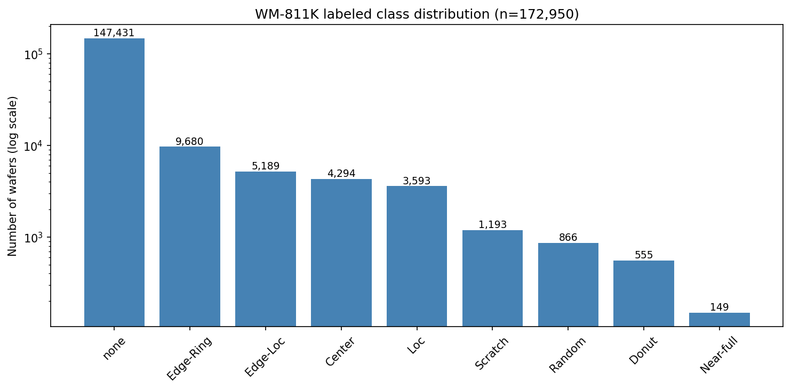

# Wafer Map Defect Pattern Classification (WM-811K)

**Spatial defect-pattern classification on 172,950 production wafer maps, with each pattern interpreted back to a likely process root cause.**

> **Project status: in progress — Stages 1–2 of 5 complete.**
> Data engineering, exploratory analysis, and physically-motivated feature
> engineering are done and reproducible. Modeling and evaluation (Stages 4–5)
> are the next phases; see the [Roadmap](#roadmap).

---

## Why this project

In high-volume semiconductor manufacturing, a wafer map is a spatial pass/fail
record of every die on a wafer. The *shape* of the failing region is
diagnostic: a ring of failures at the edge implicates a different process step
than a tight cluster at the center or a thin diagonal line. Today much of this
pattern review is done by eye, which is slow, subjective, and does not scale to
the volume a modern fab produces.

This project automates that first triage step — classifying each wafer map into
one of nine spatial defect patterns — and, crucially, **maps each pattern to
the process mechanism most likely to have produced it.** That second half is
the point. A classifier that says "this is an Edge-Ring" is a data-science
result; a classifier whose output tells a yield engineer *to go audit
edge-bead removal and bevel processes rather than deposition chemistry* is a
metrology tool. I approach the problem from that process-engineering angle
throughout.

**Target patterns (9 classes):** `Center`, `Donut`, `Edge-Ring`, `Edge-Loc`,
`Loc`, `Scratch`, `Random`, `Near-full`, `none`.

---

## Dataset — WM-811K (LSWMD)

Real wafer maps collected from fabrication, released by the MIR Lab. Each map
encodes `0` = outside the wafer, `1` = die passed test, `2` = die failed test.

| Property | Value |
|---|---|
| Total wafer maps | 811,457 |
| Hand-labeled maps used | 172,950 |
| Classes | 9 |
| Largest class (`none`) | 147,431 |
| Smallest class (`Near-full`) | 149 |
| Class imbalance ratio | ~989 : 1 |
| Distinct wafer-map shapes | 346 |

### Data-integrity findings

Before any modeling, the raw file needed careful auditing. Several traps here
would silently corrupt a naive pipeline:

- **The `failureType` column is not what it appears to be.** Labels are stored
  as *nested numpy arrays*, and unlabeled wafers hold an **empty array rather
  than `NaN`**. A standard `df.dropna()` therefore removes nothing and quietly
  returns all 811k rows — you would train on ~638k label-less wafers with no
  error and no warning. Handled with a custom unwrapping function that converts
  empty arrays to true nulls before filtering.
- **The official train/test split is inverted** (Test = 118,595 vs Training =
  54,355). This is departed from deliberately; a fresh stratified split is
  performed in Stage 3, and the reasoning is documented rather than hidden.
- **Label noise in the `none` class.** Direct inspection found maps labeled
  `none` that carry visible edge-failure structure. `none` means "no
  systematic pattern was annotated," which is not the same as "clean" — and it
  is *not* the same as "unlabeled" (never reviewed). This distinction is
  tracked throughout.
- **346 distinct map shapes.** Wafer maps vary in pixel dimensions by product
  and die size. A defect pattern is defined by its *geometry on the wafer*, not
  its pixel count — which is the technical justification for the
  size-invariant features below.

---

## Approach — two parallel routes

The project builds two independent representations of every wafer and will
compare them head-to-head:

1. **CNN route.** Every map is resized to a fixed 64×64 grid so the maps can be
   stacked into a single tensor a convolutional network can consume. High
   ceiling on accuracy, but a black box — it cannot tell a process engineer
   *why* it flagged a wafer.

2. **Classical route.** A compact set of hand-crafted, physically-motivated
   features feeds a classical model (Random Forest / XGBoost / SVM). Lower
   ceiling, but every feature traces to a named process mechanism, and the
   model's feature-importance output is directly interpretable.

For a defect-metrology or lithography role, the interpretable route is arguably
the more important of the two — it is what demonstrates understanding of the
physics rather than just the library calls. Building both, and comparing them,
is a deliberate choice.

---

## Feature engineering (classical route)

Each hand feature is designed from a physical hypothesis about how a specific
pattern arises, and each is **size-invariant** so wafers of any pixel dimension
are directly comparable.

| Feature group | What it measures | Patterns it separates | Process interpretation |
|---|---|---|---|
| **Radial density profile** (10 concentric rings) | Failure rate as a function of normalized radius, center → edge | Center · Donut · Edge-Ring · none | Radial process non-uniformity — the same center-to-edge framing used to analyze CMP removal rate, spin-coat thickness, or hot-plate temperature gradients |
| **Radon linearity** (peak, peak-to-mean ratio) | Presence and strength of *collinear* failures | Scratch | Mechanical handling damage (robot end-effector, tweezer/wand contact, a dragged particle) — a signature distinct from process-chemistry defects |
| **Connectivity** (largest-blob fraction, fragmentation) | One contiguous failing region vs. scattered speckle | Near-full vs Random | Global process excursion (wrong recipe, gross exposure/bake failure) vs. distributed particle contamination |
| **Angular concentration** (histogram peakedness) | How concentrated failures are around the wafer's angular range | Edge-Ring (full wrap) vs Edge-Loc (localized arc) | Rotationally-symmetric process signature (edge-bead removal, bevel etch) vs. a single point of chuck/clamp contact |

**Why density alone is not enough — the Scratch case.** A scratch may be ~15
failed dies out of ~1,500. Its failure *rate* is indistinguishable from
background noise; the entire signal lives in the *arrangement* of those dies,
not their count. The Radon transform integrates the failure map along straight
lines at many angles, so a set of collinear failures stacks into a sharp peak
that a density metric is blind to. This is the clearest example of encoding
domain physics directly into a feature.

### Honest engineering notes

These are kept in the notebooks rather than scrubbed out, because the process
of diagnosing and fixing a feature is itself evidence of engineering judgment:

- **The first angular feature failed.** A gap-based "angular coverage" measure
  could not separate Edge-Ring from Edge-Loc — a few stray failures filled the
  "empty" arc and made a localized Edge-Loc read as fully wrapped. It was
  re-designed as a histogram-based *concentration* measure, which is robust to
  strays because they dilute across bins. Both versions are retained.
- **Dead / redundant features were found on inspection.** The two outermost
  radial rings fall in the empty corners outside the circular wafer (no dies,
  always zero), and one Radon summary turned out to duplicate another. These
  are flagged for trimming — feature-importance analysis in Stage 4 will
  confirm.
- **Edge-Ring vs Edge-Loc is expected to be the hard pair.** Both are
  edge-dominated and differ only in angular spread. This is predicted *now*,
  from feature behavior, and will be checked against the Stage 5 confusion
  matrix.

---

## Methodology principles

- **Metric discipline.** Under ~989:1 imbalance, accuracy is misleading: a
  model that predicts `none` for every wafer scores ~85% accuracy while
  catching zero defects. **Macro-F1 and per-class precision/recall/F1 are the
  primary metrics** and are committed to *before* any results exist.
- **Categorical-aware preprocessing.** Wafer pixels are categories (outside /
  pass / fail), not intensities. All resizing uses nearest-neighbor
  interpolation; bilinear resizing would average neighboring dies into
  fractional "half-failed" states that correspond to nothing physical. This is
  verified visually and numerically in the notebook.
- **Alignment discipline.** The image tensor, the feature table, and the label
  array are asserted to be row-aligned at every stage — a single silent
  misalignment would make every downstream metric meaningless.
- **Reproducibility.** Fixed random seeds; compute on Kaggle Notebooks; each
  stage committed as a standalone, re-runnable notebook.

---

## Exploratory analysis

<!-- Add exported figures to an images/ folder and they will render here. -->

*Log-scale class distribution across the 172,950 labeled wafers — the ~989:1
imbalance that drives the metric choices above.*


*Representative wafer maps for each of the nine classes. Note the high
intra-class variance in Donut (from clean annulus to partial crescent) and the
visible edge structure in some maps labeled `none`.*

---

## Results

**In progress.** Modeling is Stage 4. The evaluation protocol is fixed in
advance: classical baseline and CNN compared on **macro-F1 and per-class F1**,
with a **confusion matrix read by physical mechanism** — i.e. every confusion
is explained in terms of which process signatures genuinely resemble each
other, not just which cells are dark. A short yield-economics layer translates
classifier performance into fab-relevant terms (cost of a missed defect
pattern vs. a false flag).

---

## Roadmap

- [x] **Stage 1** — Load, data-integrity audit, exploratory analysis
- [x] **Stage 2** — Preprocessing (64×64 tensor) + size-invariant feature engineering
- [ ] **Stage 3** — Class-imbalance handling (re-split, resampling, class weights, rotation/flip augmentation)
- [ ] **Stage 4** — Classical baseline (Random Forest / XGBoost / SVM), then a small CNN; head-to-head comparison
- [ ] **Stage 5** — Per-class evaluation, confusion matrix interpreted physically, process root-cause writeup, business-impact layer

---

## Repository structure

```
.
├── notebooks/
│   ├── 01_data_loading_eda.ipynb      # Stage 1: load, integrity audit, EDA
│   └── 02_preprocessing.ipynb          # Stage 2: 64x64 tensor + hand features
├── images/                             # exported figures for this README
├── .gitignore
└── README.md
```

Data files (`*.pkl`, `*.npy`) are intentionally excluded from version control;
the dataset is available from the source below.

---

## Tech stack

Python · pandas · NumPy · scikit-learn · scikit-image (Radon transform,
categorical-safe resizing) · SciPy (connected-component labeling) · Matplotlib.
CNN stage: to be added.

---

## Data source

WM-811K / LSWMD, originally released by the MIR Lab (National Taiwan
University). This project uses the publicly mirrored version and does not
redistribute the raw data.

---

*Author's note: I come to this from a process/fabrication background
(cleanroom, lithography, thin films, SEM/TEM/XPS metrology). The
process-root-cause interpretation is the deliberate focus of the work — the
per-pattern root-cause analysis will be expanded in my own words in the Stage 5
writeup.*
